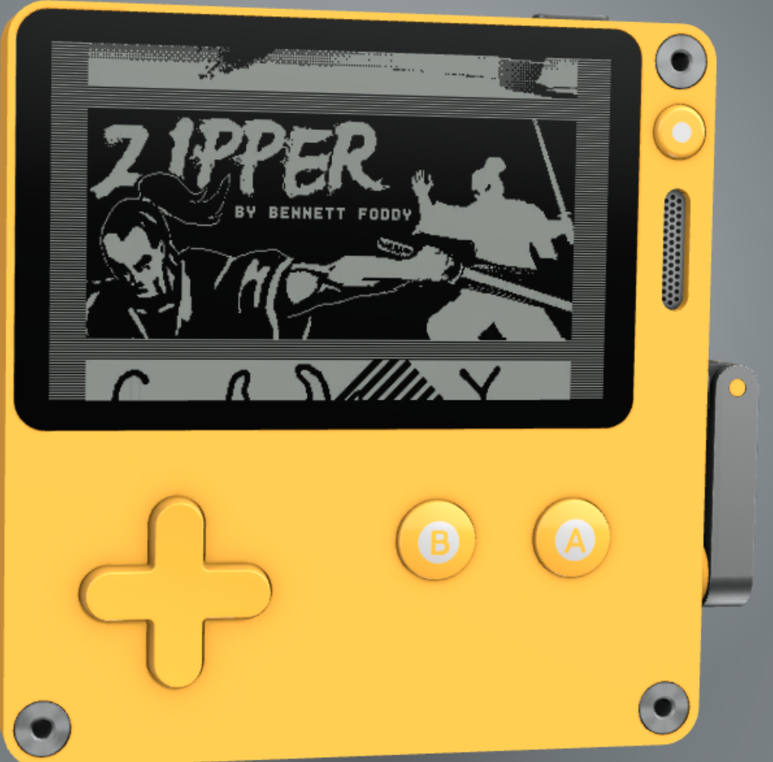
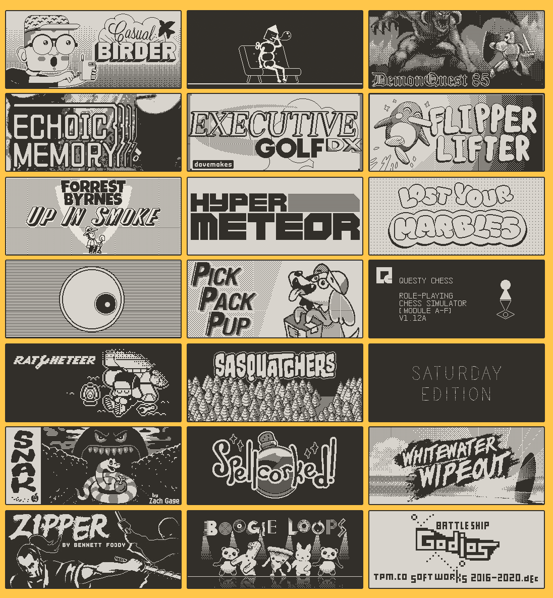

# Your Name

🖖 pk

## City and Country

🌏 Lived & Worked in 20+ countries, currently domisciled in Australia

## Background

🌴 I grew up building things out of whatever we could find in our garden. I can still make mechanical and sound-making toys out of coconut tree branches and leaves

🩺 Wanted to study medicine, to become a doctor, as I used to faint at the sight of blood, decided to become a computer science engineer

👨‍💼 Started my MBA program in Chicago and at the same time got an opportunity to work with the inventors of programming language `C` so I decided to go and work with them instead

💼 Then ended up on Wall St and working at a Big 4, living out of 2 suitcases and traveling around the globe

₿ fast forward several years, I discovered bitcoin, left the firm and have been in blockchain ever since

🔴 when i read the whitepaper for polkadot, i began to understand why Gavin wanted to create a multi-chain universe and totally fell in love with the grandeous vision

🦀 now i mostly invest my time learning rust, building web3 lego blocks, researching network state, and assembling AMD Threadripper HEDT

## Why you're excited about Acala, Karura, and DeFi

🧮 i discovered the mechanics of finance quite late in my education and not until I began working I was able to experiment and implement concepts such as compounding, leverage, etc. to build a portoflio

🇳🇿 with the help of Karura & Acala, i strongly believe we can demystify most of the financial concepts and instruments into basic `DeFi` lego blocks

💡 i have an idea to create `HyFi` games in [playdate](https://play.date/) for my son and open-source it

🤑 essentially anyone can bring their Karura and Acala assets into playdate and use them to learn more about HyFi concepts, interact with the in-game characters, and in the process begin to build their portfolio

## Fun facts and details about yourself

⛰️ in my younger days, ascended 3 of 7 mountain peaks  
🚴 transitioned to long distance cycling  
🧘 currently focussed in tuning my body w/ yoga and mind w/ vipassana  
🎮 experimenting with how to build games for my son

